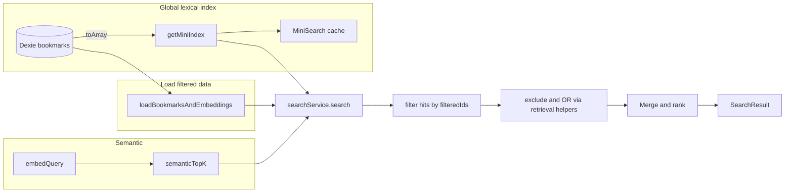

# MiniSearch lexical integration plan (revised)

## Current state

- **Keyword path:** [src/search/retrieval.ts](src/search/retrieval.ts) implements `keywordSearchStructured(bookmarks, parsed)` with regex term matching, `FIELD_WEIGHTS` (title 2, domain 1.5, folderPath 1, url 0.8), exclude terms, OR groups, and phrase scoring. Results are `KeywordHit[]` with `matchedTerms`, `matchedIn`, `matchedPhrases`, `score`. Helpers: `bookmarkMatchesExclude`, `bookmarkMatchesOrGroup`, `termMatchesField`, `phraseMatchesField`.
- **Search flow:** [src/search/searchService.ts](src/search/searchService.ts) loads filtered bookmarks + embeddings via `loadBookmarksAndEmbeddings(filters)`, runs semantic (embedQuery + semanticTopK) and keyword (keywordSearchStructured), merges candidates, combines scores with ALPHA 0.55, applies phrase/junk/recency, builds "why matched" from `KeywordHit` and semantic.
- **Bookmark writes:** [src/import/importService.ts](src/import/importService.ts) (`runImport` — put in loop, clear in replace; `clearAllBookmarks` — clear); [src/sync/ingestDeltas.ts](src/sync/ingestDeltas.ts) (`ingestDeltas` — put/delete in loop; `ingestResyncBatch` — put in loop).

## Architecture after change

- **Lexical:** One **global** MiniSearch index over all bookmarks, built from `db.bookmarks.toArray()` inside `getMiniIndex()`. Index is cached in memory; `invalidateMiniIndex()` clears cache so next search rebuilds. Search runs once with `parsed.searchText`; folder/domain/dateRange filtering is applied by **filtering MiniSearch hits** using `filteredIds` (the set of bookmark ids that passed `loadBookmarksAndEmbeddings`). OR and exclude semantics are enforced by **validating** MiniSearch hits with existing helpers from retrieval.ts: `bookmarkMatchesExclude`, `bookmarkMatchesOrGroup` (and thus `termMatchesField`, `phraseMatchesField`). Do **not** run MiniSearch once per OR group.
- **Semantic:** Unchanged (embedQuery, semanticTopK, 50 candidates).
- **Scoring:** Keep current ALPHA mixing (0.55 semantic, 0.45 keyword) and all existing constants (phrase boost, junk penalty, recency). No scoring changes in this plan. **Future improvement (optional):** consider RRF (Reciprocal Rank Fusion) as a later milestone for combining lexical and semantic rankings.
- **Why matched:** Use `inferKeywordSignals(bookmark, parsed)` with the **exported** `termMatchesField` and `phraseMatchesField` from retrieval.ts to infer `matchedTerms`, `matchedIn`, `matchedPhrases`; then `buildReasons` / `formatReasons`. buildReasons fieldMap includes `'url'` mapped to the existing label `'site'` so URL-only matches still produce a keyword reason (WhyMatchedReason type unchanged).

---

## Milestone 1: Dependency and miniIndex module

**Goal:** Add MiniSearch and a module that builds/caches a **global** MiniSearch index over all bookmarks.

**Tasks:**

1. Add dependency: `minisearch` (e.g. `npm install minisearch`). No type package needed if the library ships types.
2. Create [src/search/miniIndex.ts](src/search/miniIndex.ts):

   - Dependencies: `MiniSearch` from `minisearch`, `db` from `../db`, type `Bookmark`.
   - Document shape: `{ id: number, title: string, url: string, domain: string, folderPath: string }` with `id` = bookmark id. Index config: `fields: ['title', 'domain', 'folderPath', 'url']`, `storeFields: ['id', 'title', 'url', 'domain', 'folderPath']`, `idField: 'id'`.
   - **`getMiniIndex(): Promise<MiniSearch<Doc>>`:** If a cached index exists (e.g. same “version” or non-null cache), return it. Otherwise load **all** bookmarks with `db.bookmarks.toArray()`, map to doc shape, build index with `addAll(docs)`, cache it, return. Do **not** accept a bookmarks parameter; the index is always global over the full DB.
   - **`invalidateMiniIndex()`:** Clear the in-memory cache so the next `getMiniIndex()` rebuilds from `db.bookmarks.toArray()`.
   - Search options (used by callers): prefix `true`, fuzzy `0.1`–`0.2`, boost `{ title: 2, domain: 1.5, folderPath: 1, url: 0.8 }`.

**Deliverable:** New file; `getMiniIndex` and `invalidateMiniIndex` exported; no callers yet.

**Commit:** e.g. `feat(search): add MiniSearch dependency and miniIndex module`

---

## Milestone 2: Wire invalidation once per write batch

**Goal:** Invalidate the MiniSearch index once per write batch (not inside loops).

**Tasks:**

1. In [src/import/importService.ts](src/import/importService.ts):

   - Import `invalidateMiniIndex` from `../search/miniIndex`.
   - In `runImport`: call `invalidateMiniIndex()` **once** at the end of the success path (after `db.imports.update(...)`), not inside the per-bookmark loop.
   - In `clearAllBookmarks`: call `invalidateMiniIndex()` **once** after clearing the DB.

2. In [src/sync/ingestDeltas.ts](src/sync/ingestDeltas.ts):

   - Import `invalidateMiniIndex` from `../search/miniIndex`.
   - In `ingestDeltas`: call `invalidateMiniIndex()` **once** at the end of the function (after the loop).
   - In `ingestResyncBatch`: call `invalidateMiniIndex()` **once** at the end of the function (after the loop).

**Deliverable:** All bookmark write paths invalidate the index exactly once per batch; no change to search logic yet.

**Commit:** e.g. `chore(search): invalidate MiniSearch index on bookmark writes`

---

## Milestone 3: Replace keyword search with MiniSearch in searchService

**Goal:** Use MiniSearch for lexical search instead of `keywordSearchStructured`. Global index; filter hits by `filteredIds`; enforce OR and exclude with existing retrieval helpers.

**Tasks:**

1. In [src/search/retrieval.ts](src/search/retrieval.ts): Export `bookmarkMatchesExclude`, `bookmarkMatchesOrGroup`, and `termMatchesField` for use in searchService (exclude/OR validation) and in `inferKeywordSignals` (Milestone 4). These are currently used only inside `keywordSearchStructured`; exporting avoids duplicating escapeRegex + word-boundary logic elsewhere.
2. In [src/search/searchService.ts](src/search/searchService.ts):

   - Import `getMiniIndex` from `./miniIndex` and `bookmarkMatchesExclude`, `bookmarkMatchesOrGroup` from `./retrieval`. Build `bookmarkById` from filteredBookmarks for lookups.
   - **Load and filter as today:** Call `loadBookmarksAndEmbeddings(effectiveFilters)` to get `filteredBookmarks` and embeddings. Compute `filteredIds = new Set(filteredBookmarks.map(b => b.id).filter(Boolean))` (or equivalent). Keep `bookmarkById` map for lookups.
   - **Lexical path:** Call `const mini = await getMiniIndex()` (no argument). Search with `parsed.searchText`; options: `prefix: true`, `fuzzy: 0.15` (or 0.2), `boost: { title: 2, domain: 1.5, folderPath: 1, url: 0.8 }`. Map MiniSearch results to `{ bookmarkId: doc.id, score }`.
   - **Apply folder/domain/date filter:** Keep only hits whose `bookmarkId` is in `filteredIds`. So: lexical candidates = MiniSearch hits filtered by `filteredIds`.
   - **Exclude and OR:** For each remaining hit, resolve bookmark via `bookmarkById.get(bookmarkId)`. Drop hits where `bookmarkMatchesExclude(bookmark, parsed.excludeTerms)` is true. If `parsed.orGroups.length > 1`, keep only hits where **at least one** OR group matches: for some `group` in `parsed.orGroups`, `bookmarkMatchesOrGroup(bookmark, group)` is true. Use the **existing** helpers from [src/search/retrieval.ts](src/search/retrieval.ts); do **not** run MiniSearch once per OR group.
   - **Keyword-only path (no embeddings):** When `semanticItems.length === 0`, lexical candidates (after filteredIds + exclude + OR) are normalized and merged with phrase/junk/recency as today; cap at 10; build “why matched” using `inferKeywordSignals` (Milestone 4) and `buildReasons` / `formatReasons`.
   - **Hybrid path:** Candidates = union of semantic top-50 and filtered lexical hits; merge and rank with **current scoring** (ALPHA * semantic + (1 - ALPHA) * normKeyword + phraseBoost - junkPenalty + recencyBoost); strong vs related logic unchanged.
   - Preserve empty-query and filter-only branch: if `searchText` is empty and only filters apply, return filter-only results as today (no MiniSearch call).
   - **buildReasons:** In [src/search/searchService.ts](src/search/searchService.ts), update `buildReasons` so that (1) `'url'` is included in its fieldMap / matching logic; (2) when `matchedIn` includes `'url'`, emit a keyword reason using the existing label `'site'` (do not change the WhyMatchedReason type); (3) keep current reason cap behavior (max 2 reasons).

2. **Type compatibility:** Keep returning `SearchResult[]` with `whyMatched`, `reasons`, `matchedTerms`, `matchTier` as today. Keyword-hit structure for merge is `{ bookmarkId, score }`; reasons come from `inferKeywordSignals` + `buildReasons`.

**Deliverable:** searchService uses MiniSearch (global index), filters hits by filteredIds, validates with bookmarkMatchesExclude/bookmarkMatchesOrGroup; semantic and scoring unchanged; keyword-only and hybrid paths work.

**Commit:** e.g. `feat(search): use MiniSearch for lexical search in hybrid pipeline`

---

## Milestone 4: inferKeywordSignals and why matched

**Goal:** Add `inferKeywordSignals(bookmark, parsed)` for stable whyMatched; keep keyword-only behavior correct.

**Tasks:**

1. Add **`inferKeywordSignals(bookmark: Bookmark, parsed: ParsedQuery)`** in [src/search/retrieval.ts](src/search/retrieval.ts) (or searchService if preferred to avoid retrieval depending on nothing). It returns a structure compatible with `KeywordHit` (without score):

   - **matchedTerms:** For each `parsed.terms`, use `termMatchesField(term, field)` for title, url, folderPath, domain; collect terms that match at least one field.
   - **matchedIn:** Collect fields that had at least one term match (e.g. `'title' | 'url' | 'folderPath' | 'domain'`); use existing `MatchedIn` type.
   - **matchedPhrases:** For each `parsed.phrases`, use `phraseMatchesField(bookmark.title, phrase)` (and url, folderPath, domain); build `{ phrase, field }[]` with existing `phraseMatchesField` from retrieval.
   - Return `{ matchedTerms, matchedIn, matchedPhrases }` so that `buildReasons(keywordHit, hasSemantic)` and `formatReasons(reasons)` work unchanged.

2. In searchService, for every MiniSearch-backed result (keyword-only and hybrid), call `inferKeywordSignals(bookmark, parsed)` and pass the result into `buildReasons` so “why matched” is stable and field-accurate (buildReasons already updated in Milestone 3 to map url → 'site').
3. Verify keyword-only path: no embeddings → only MiniSearch path; results use `inferKeywordSignals` for reasons; no semantic reason.

**Deliverable:** Stable whyMatched via `inferKeywordSignals`; no dependency on MiniSearch exposing matched fields.

**Commit:** e.g. `fix(search): inferKeywordSignals for why matched and keyword-only path`

---

## Milestone 5: Dev regression harness

**Goal:** Add a small, dev-only harness to run sample queries and log top results.

**Tasks:**

1. Create [src/search/searchHarness.ts](src/search/searchHarness.ts):

   - Import `search` from `./searchService` and optionally `db` from `../db`.
   - Export `runSearchHarness()`: runs 3–5 sample queries (keyword, phrase, site:/folder:, natural-language); for each calls `search(query, {})` and logs query and top 3–5 results (title, url, score, whyMatched). No test framework; `console.log` only. Invokable from browser console or a small dev entry.

2. Document in ARCHITECTURE or README how to run it (e.g. run app, open console, call `runSearchHarness()`). No mandatory npm script; keep minimal.

**Deliverable:** One new file; manual sanity check only.

**Commit:** e.g. `chore(search): add dev-only search regression harness`

---

## Milestone 6: ARCHITECTURE.md update (maintainer-friendly structure)

**Goal:** Update ARCHITECTURE.md so the retrieval section is maintainer-friendly and reflects MiniSearch. Use the following structure for the **Retrieval / search** section (and related edits).

**Structure to apply:**

1. **Overview** — Short paragraph: search is hybrid (lexical + semantic); lexical via MiniSearch over all bookmarks; semantic unchanged; filters and operators preserved.
2. **Data model** — No change to Dexie schema; MiniSearch index is in-memory, built from `db.bookmarks.toArray()`, document shape and fields as in miniIndex.ts.
3. **Ingest paths** — Where bookmarks are written (import, clearAll, ingestDeltas, ingestResyncBatch); each path calls `invalidateMiniIndex()` once per batch so the next search rebuilds the global index.
4. **Search pipeline** — Numbered sub-sections:

   - **Query parse** — parseQuery (site:, folder:, phrases, exclude, OR) → searchText and effectiveFilters.
   - **Filters** — loadBookmarksAndEmbeddings(filters) → filteredBookmarks, embeddings; filteredIds used to filter MiniSearch hits.
   - **Lexical (MiniSearch lifecycle)** — getMiniIndex() builds index from db.bookmarks.toArray() when cache is empty; cache invalidated on any write batch. Search with parsed.searchText, prefix, fuzzy, boost; hits filtered by filteredIds; exclude and OR enforced via bookmarkMatchesExclude, bookmarkMatchesOrGroup.
   - **Semantic** — embedQuery, semanticTopK (50); unchanged.
   - **Merge and rank** — Union of lexical and semantic candidates; ALPHA 0.55 semantic + (1 - ALPHA) keyword; phrase/junk/recency; strong vs related. Add one sentence: *Future improvement (optional):* RRF rank fusion could be added as a later milestone.
   - **Why matched** — inferKeywordSignals(bookmark, parsed) using exported termMatchesField and phraseMatchesField; buildReasons (fieldMap includes url → 'site') / formatReasons unchanged.

5. **Manual regression checklist** — Bullets: Import, Index, Search (keyword, phrase, filters, site:/folder:), Chat, Lexical/MiniSearch (keyword-only path, run harness optionally), Offline. Integrate “Lexical / MiniSearch” and “keyword-only” into the existing checklist.
6. **Key files** — Add [src/search/miniIndex.ts](src/search/miniIndex.ts); add [src/search/searchHarness.ts](src/search/searchHarness.ts) as dev-only. Update Search row to mention miniIndex and MiniSearch.

**Deliverable:** ARCHITECTURE.md section 7 (and key files table) restructured as above; no new top-level sections elsewhere unless needed for consistency.

**Commit:** e.g. `docs: ARCHITECTURE MiniSearch lexical engine and test checklist`

---

## Implementation notes

- **Guardrail compliance checks (must pass before milestone closure):**
  - **Minimal dependency rationale:** `minisearch` is the only new dependency and is used strictly to replace the current regex lexical path in Milestone 4; do not add other search abstractions or helper libraries.
  - **Performance acceptance check:** after first post-invalidation rebuild, verify representative query latency remains within the project target (~500 ms after indexing) on ~1,000 bookmarks; if rebuild causes visible UI jank, schedule follow-up to move lexical index build/search off main thread.
  - **Milestone mapping discipline:** treat Milestones 1-5 in this plan as implementation details inside product Milestone 4 (Search & Filters), with Milestone 2 touching Milestone 6 ingestion write paths only for cache invalidation correctness.
  - **Scope lock:** do not modify `docs/SPEC.md`; do not add backend/auth/content-fetching behavior; keep retrieval-only chat semantics unchanged.

- **Global index:** `getMiniIndex()` always uses `db.bookmarks.toArray()` to build the index. searchService then restricts to `filteredIds` (from loadBookmarksAndEmbeddings) and validates with bookmarkMatchesExclude / bookmarkMatchesOrGroup. Single MiniSearch call per query.
- **OR and exclude:** Do **not** run MiniSearch per OR group. One search with parsed.searchText; then filter hits using existing retrieval helpers.
- **Scoring:** No changes. Future improvement note only (RRF).
- **termMatchesField:** Exported from retrieval.ts (alongside bookmarkMatchesExclude, bookmarkMatchesOrGroup) so inferKeywordSignals can use it without duplicating escapeRegex + word-boundary logic.
- **inferKeywordSignals:** Implement using the **exported** termMatchesField and phraseMatchesField from retrieval.ts only; keeps whyMatched stable and consistent.
- **buildReasons / URL:** buildReasons in searchService (Milestone 3) includes `'url'` in its fieldMap, mapped to the existing label `'site'` (WhyMatchedReason type unchanged), so URL-only matches still produce a keyword reason (“Matches in site: …”).
- **Invalidation:** Once per batch in runImport (end), clearAllBookmarks (end), ingestDeltas (end), ingestResyncBatch (end).
- **No new backend/server:** All logic in browser; MiniSearch in-memory; index from Dexie.
- **Performance:** Index build O(n) on first search after invalidation; ~1,000 bookmarks is acceptable. Cache avoids rebuild every query.

---

## Summary of commits (per milestone)

1. `feat(search): add MiniSearch dependency and miniIndex module`
2. `chore(search): invalidate MiniSearch index on bookmark writes`
3. `feat(search): use MiniSearch for lexical search in hybrid pipeline`
4. `fix(search): inferKeywordSignals for why matched and keyword-only path`
5. `chore(search): add dev-only search regression harness`
6. `docs: ARCHITECTURE MiniSearch lexical engine and test checklist`