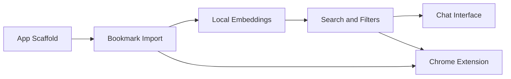

# ShelfEngine Implementation Milestones

This document details the implementation milestones for ShelfEngine. Milestones map to [SPEC.md](SPEC.md) and the locked tech stack (TypeScript, React + Vite, PWA, Dexie, transformers.js, Web Workers). Each milestone is dependency-aware and produces a working, demoable state. No backend or auth until explicitly required (optional OAuth is deferred to the extension milestone).

---

## Milestone 1: App Scaffold

**Goal:** Ship a minimal PWA shell with IndexedDB (Dexie) schema and a basic layout so the app loads, installs, and shows structure. No bookmark data yet.

**Key files / components:**
- Vite + React + TypeScript app entry (`index.html`, `src/main.tsx`, `src/App.tsx`)
- PWA: `vite.config` (e.g. `vite-plugin-pwa`), `manifest.webmanifest`, service worker (offline shell + cache-first for assets)
- Dexie schema: e.g. `src/db/schema.ts` or `src/db/index.ts` defining stores `bookmarks`, `embeddings`, `imports` per spec
- Basic layout: shell with placeholder nav/sidebar and main content area (e.g. "Import" and "Search" placeholders)

**Done when:**
- App runs locally and builds for production
- PWA is installable and loads offline after first visit
- IndexedDB is created with the three object stores; app opens without errors

---

## Milestone 2: Bookmark Import

**Goal:** Parse Chrome `bookmarks.html`, extract title, URL, folder path, add date; deduplicate by normalized URL; persist to IndexedDB and track import status. Support re-import with **merge** (dedupe) or **replace**.

**Key files / components:**
- Parser: `src/import/parseBookmarksHtml.ts` (or similar) — parse HTML, extract `<a>` + folder hierarchy, normalize URLs
- Import service: `src/import/importService.ts` — orchestrate parse → dedupe → write to `bookmarks` store, update `imports` store (importId, status, counts, createdAt, error)
- UI: Import screen with file input, "Merge" vs "Replace" choice, and status/feedback (counts, errors)
- DB: use existing `bookmarks` and `imports` stores from Milestone 1

**Done when:**
- User can select a real Chrome `bookmarks.html` and run import
- Bookmarks appear in IndexedDB with correct fields (id, url, title, domain, folderPath, addDate, createdAt)
- Re-import with "Merge" does not create duplicate URLs; "Replace" clears and re-imports
- Import status (e.g. success/failure, counts) is visible in the UI

---

## Milestone 3: Local Embeddings

**Goal:** Generate embeddings for bookmarks in a Web Worker using transformers.js; store vectors in IndexedDB. Text for embedding = title + hostname + folder path (per spec). Triggered as part of import (or a dedicated "Build index" step after import).

**Key files / components:**
- Worker: `src/workers/embedding.worker.ts` — load transformers.js model, accept batch of strings, return vectors
- Embedding service: `src/embeddings/embeddingService.ts` — prepare concatenated text per bookmark, call worker, write to `embeddings` store (bookmarkId, vector, modelName, createdAt)
- Integration: after import (or on demand), iterate bookmarks, batch calls to worker, persist to `embeddings`
- Progress/status in UI (e.g. "Indexing… 450/1000") so the 60s target is observable

**Done when:**
- After import, embeddings are generated in a worker and stored in `embeddings`
- No main-thread blocking; indexing ~1,000 bookmarks completes in under ~60 seconds
- Embeddings can be verified (e.g. count in DB or a simple dev-only "run one query" button)

---

## Milestone 4: Search & Filters

**Goal:** Keyword + semantic search over bookmarks (cosine similarity, top-K = 10), optional keyword-overlap boost; filters by folder path, domain, date added. Results show title, URL, folder path, and a short "why matched" explanation.

**Key files / components:**
- Retrieval: `src/search/retrieval.ts` (or similar) — load embeddings, cosine similarity, top-K, optional keyword boost; return bookmark IDs + scores/snippets for "why matched"
- Search service: `src/search/searchService.ts` — combine keyword filter + semantic retrieval, apply filters (folder, domain, date)
- UI: Search bar, filter controls (folder dropdown, domain, date range), results list with cards (title, URL, folder, "why matched")
- Use existing `bookmarks` and `embeddings` stores; no backend

**Done when:**
- User can type a query and see ranked results in under ~500 ms (after index exists)
- Filters narrow results correctly (folder, domain, date)
- Each result shows a short, honest "why matched" (e.g. keyword hit or semantic similarity), no generative text

---

## Milestone 5: Chat Interface

**Goal:** Chat UI that treats each user message as a semantic query; display results as bookmark cards with "why matched." No LLM or generative responses — retrieval-only "chat."

**Key files / components:**
- Chat UI: `src/components/Chat.tsx` (or `src/views/Chat.tsx`) — message list, input, send button
- Behavior: on send, run same search/retrieval as Milestone 4 with message text as query; append user message + result cards to thread
- Reuse: `searchService` and result card component from Milestone 4

**Done when:**
- User can type natural-language in chat and get bookmark results with "why matched"
- No generative reply text; only user message + result cards
- Acceptance: "Retrieve a previously saved link in under 10 seconds using a vague, natural-language query"

---

## Milestone 6: Chrome Extension (Manifest V3)

**Goal:** Optional automatic sync. The extension listens for bookmark events and applies deltas to ShelfEngine using a strict bridge pattern. Queue changes while ShelfEngine is closed, then flush on next open. This must not require backend or login.

**Bridge pattern (must use this):**
- Use a content script that runs only on the ShelfEngine origin.
- Background service worker collects bookmark deltas.
- Background sends deltas to the content script.
- Content script forwards deltas into the web app via `window.postMessage`.
- The web app ingests deltas and writes to Dexie in IndexedDB.

**Key files / components:**
- `extension/manifest.json` (MV3)
- `extension/background.ts` (service worker)
  - Registers listeners: `chrome.bookmarks.onCreated`, `onChanged`, `onMoved`, `onRemoved`
  - Normalizes events into a delta format:
    - upsert: { url, title, folderPath, addDate, domain }
    - remove: { url }
- `extension/contentScript.ts`
  - Runs only on the ShelfEngine site
  - Receives deltas from background and forwards them to the page using `window.postMessage`
- Queueing
  - When ShelfEngine is not open, background stores deltas in `chrome.storage.local`
  - When ShelfEngine opens, content script requests queued deltas, then background clears the queue after ack
- Web app ingestion
  - Add `src/sync/ingestDeltas.ts` to apply upserts and removes to Dexie
  - On upsert or folder change, recompute embedding for that bookmark using the existing worker path
  - Reuse existing URL normalization and folderPath logic from import

**Done when:**
- Creating, editing, moving, and deleting a bookmark in Chrome updates ShelfEngine within 10 seconds when ShelfEngine is open
- If ShelfEngine is closed, deltas are queued and applied on next open
- Core app remains usable without the extension and without login

---

## Dependency Overview

- **M1** is the base (PWA + DB schema).
- **M2** depends on M1 (storage and UI shell).
- **M3** depends on M2 (bookmarks to embed).
- **M4** depends on M3 (vectors for semantic search).
- **M5** depends on M4 (reuses search and result cards).
- **M6** can be built after M2 (import/schema) and M4 (search) are stable; it syncs bookmark data and assumes the app can ingest and query it.

---

## Out of Scope for These Milestones

- Backend or server
- Auth (except optional OAuth in M6 if backup is implemented)
- Fetching or indexing page content
- Team collaboration or mobile app
- Generative chat (only retrieval-style "chat" in M5)
