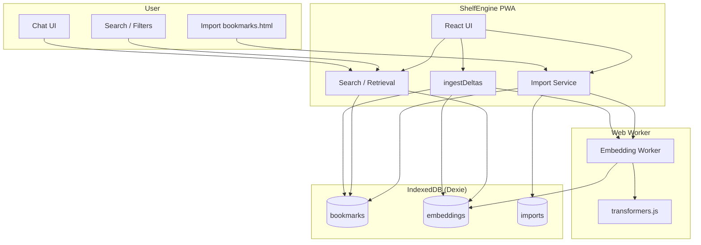
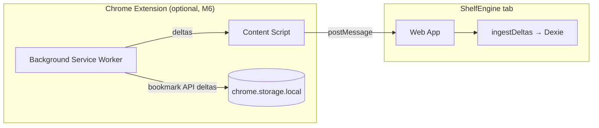

# ShelfEngine

Turn your bookmarks into a search engine.

**[Live demo](https://shelf-engine.vercel.app/)**

ShelfEngine is a **local-first web app** that lets you import your browser bookmarks once and later retrieve them using natural-language queries, search, and filters. All data stays on your device by default.

## Prerequisites

- **Node.js** 18+ (for local development)
- A modern browser (Chrome, Edge, Firefox, or Safari) for the PWA

## How to use

1. Run the app (`npm run dev`), then open it in your browser.
2. **Import** your bookmarks: upload a `bookmarks.html` file (see below).
3. Use **Search** (keyword + filters) or **Chat** (natural-language queries) to find links.

**Getting `bookmarks.html` (Chrome):** Open Bookmark Manager (`Ctrl+Shift+O` / `Cmd+Shift+O`), click the ⋮ menu, then **Export bookmarks**. Save the file and upload it in ShelfEngine’s Import page.

## Architecture





- **PWA**: Import, search, and chat run in the browser; data lives in IndexedDB. Heavy embedding work runs in a Web Worker.
- **Extension**: Optional. Background collects bookmark events, queues when the app is closed, and sends deltas to the app via a content script + `postMessage` bridge when the app is open. No shared IndexedDB.

## Tech Stack

- **TypeScript** + **React** (Vite)
- **PWA** - works offline after first load
- **IndexedDB** via Dexie.js
- **transformers.js** for local embeddings
- **Web Workers** for heavy computation
- No backend required for MVP
- Chrome extension (Manifest V3) in a later milestone

## Docs

- [SPEC.md](docs/SPEC.md) - Product and technical specification
- [MILESTONES.md](docs/MILESTONES.md) - Implementation milestones (goals, key files, done criteria)

## Development

Once the app is scaffolded (Milestone 1), you can run:

```bash
npm install
npm run dev
```

Build for production:

```bash
npm run build
```

### Load unpacked extension (dev)

1. Run the extension build:
   ```bash
   npm run build:extension
   ```
2. Open Chrome and go to `chrome://extensions`.
3. Turn on **Developer mode** (toggle in the top right).
4. Click **Load unpacked** and select the **`extension`** folder (the repo folder that contains `manifest.json`, `background.js`, `contentScript.js`, and `popup.html`). If you’re unsure, open the folder in Explorer and confirm those files are there.
5. The extension card should appear with no errors. Click the **Service worker** link under “Inspect views” to open the background script console and see logs (e.g. when you create or change a bookmark).

The extension runs on `localhost`, `127.0.0.1`, and `https://shelf-engine.vercel.app`. When the ShelfEngine app is open in a tab, bookmark changes are synced into the app; when it’s closed, deltas are queued and applied on next open.

See [MILESTONES.md](docs/MILESTONES.md) for the full implementation plan and dependency order.

## License

MIT. See [LICENSE](LICENSE) for details.
