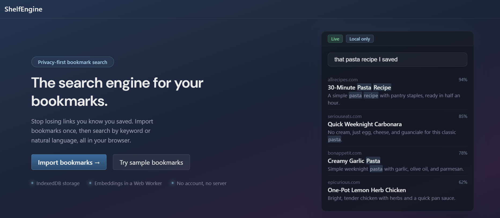
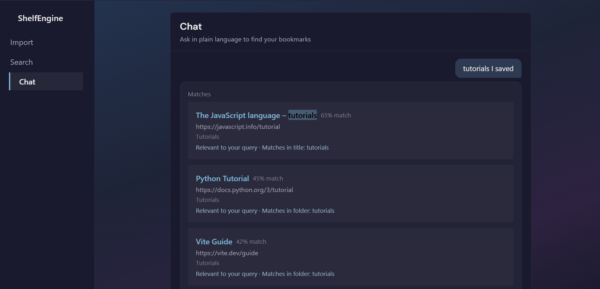
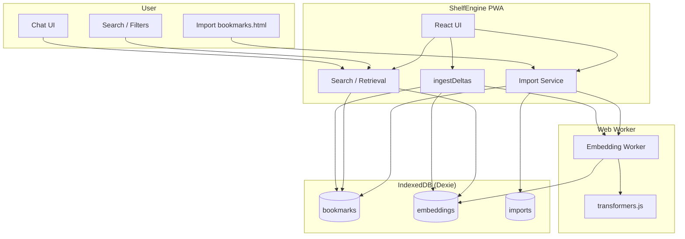
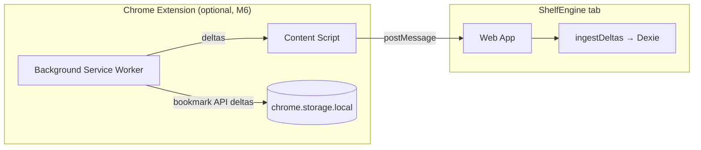

# ShelfEngine

Find what you saved. Even when you don't remember what its called

**[Live demo](https://shelf-engine.vercel.app/)**

ShelfEngine is a **local-first bookmark retrieval app** built with React + TypeScript that turns a one-time bookmarks import into fast, intent-based search. It combines lexical matching, operator-aware query parsing, and local embedding-based ranking to surface the right links from partial memory while keeping bookmark data and vectors in-browser (IndexedDB + Web Worker pipeline), with no required backend for core use.

## Preview

### Landing



### Chat retrieval



## Project Status

- **Status:** Maintenance mode.
- Core functionality is complete and usable: import, indexing, hybrid search, retrieval-only chat, and optional extension sync.
- New feature development is limited; bug fixes and documentation updates are still welcome.

## Prerequisites

- **Node.js** 18+ (for local development)
- A modern browser (Chrome, Edge, Firefox, or Safari) for the PWA

## How to use

1. Run the app (`npm run dev`), then open it in your browser.
2. **Import** your bookmarks: upload a `bookmarks.html` file (see below).
3. Use **Search** (keyword + filters) or **Chat** (natural-language queries) to find links.

**Getting `bookmarks.html` (Chrome):** Open Bookmark Manager (`Ctrl+Shift+O` / `Cmd+Shift+O`), click the ⋮ menu, then **Export bookmarks**. Save the file and upload it in ShelfEngine’s Import page.

## Architecture





- **PWA**: Import, search, and chat run in the browser; data lives in IndexedDB. Heavy embedding work runs in a Web Worker.
- **Extension**: Optional. Background collects bookmark events, queues when the app is closed, and sends deltas to the app via a content script + `postMessage` bridge when the app is open. No shared IndexedDB.

## Tech Stack

- **TypeScript** + **React** (Vite)
- **PWA** - works offline after first load
- **IndexedDB** via Dexie.js
- **transformers.js** for local embeddings
- **Web Workers** for heavy computation
- No backend required for MVP
- Chrome extension (Manifest V3) in a later milestone

## Docs

- [ARCHITECTURE.md](ARCHITECTURE.md) - End-to-end technical architecture and manual test checklist.
- [SPEC.md](docs/SPEC.md) - Historical MVP product and technical specification.
- [MILESTONES.md](docs/MILESTONES.md) - Historical MVP implementation milestones.
- [SPEC_V2.md](docs/SPEC_V2.md) - Active V2 product and technical direction.
- [MILESTONES_V2.md](docs/MILESTONES_V2.md) - Active V2 implementation milestones.

## Development

Once the app is scaffolded (Milestone 1), you can run:

```bash
npm install
npm run dev
```

Build for production:

```bash
npm run build
```

### Search harness (dev-only)

Run the app in dev mode, open the browser console, and call:

```js
window.runSearchHarness()
```

This runs a small set of sample queries through `search()` and logs the top results (title, url, score, whyMatched).

### Load unpacked extension (dev)

1. Run the extension build:
   ```bash
   npm run build:extension
   ```
2. Open Chrome and go to `chrome://extensions`.
3. Turn on **Developer mode** (toggle in the top right).
4. Click **Load unpacked** and select the **`extension`** folder (the repo folder that contains `manifest.json`, `background.js`, `contentScript.js`, and `popup.html`). If you’re unsure, open the folder in Explorer and confirm those files are there.
5. The extension card should appear with no errors. Click the **Service worker** link under “Inspect views” to open the background script console and see logs (e.g. when you create or change a bookmark).

The extension runs on `localhost`, `127.0.0.1`, and `https://shelf-engine.vercel.app`. When the ShelfEngine app is open in a tab, bookmark changes are synced into the app; when it’s closed, deltas are queued and applied on next open.

**Verification steps**

1. `npm run build:extension`
2. Load unpacked from the **`extension`** folder in Chrome (`chrome://extensions` → Developer mode → Load unpacked).
3. Open **https://shelf-engine.vercel.app** in a tab.
4. Click the extension icon, then **Resync all bookmarks**. Confirm bookmarks appear in the app (Search or Import view).
5. Close the app tab, click **Resync all bookmarks** again, then reopen **https://shelf-engine.vercel.app**. Confirm the queued resync flushes and applies (bookmarks show up).
6. Confirm the extension runs on both production origin (`https://shelf-engine.vercel.app`) and localhost (content script logs in the page console; service worker logs under the extension’s “Service worker” link).

See [MILESTONES.md](docs/MILESTONES.md) for the full implementation plan and dependency order.

## License

MIT. See [LICENSE](LICENSE) for details.
