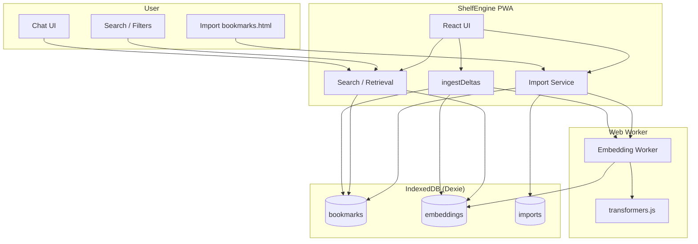
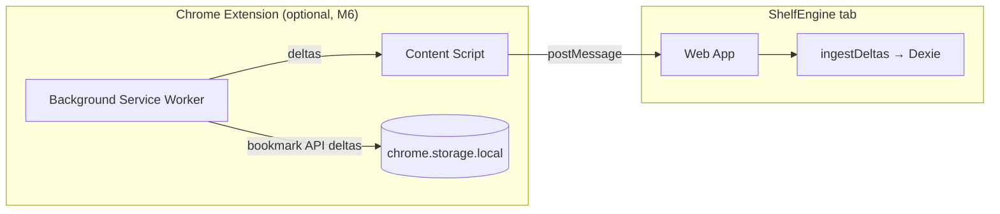

# ShelfEngine

Find saved links using what you remember about them, not folders.

ShelfEngine is a **local-first web app** that lets you import your browser bookmarks once and later retrieve them using natural-language queries, search, and filters. All data stays on your device by default.

## Architecture





- **PWA**: Import, search, and chat run in the browser; data lives in IndexedDB. Heavy embedding work runs in a Web Worker.
- **Extension**: Optional. Background collects bookmark events, queues when the app is closed, and sends deltas to the app via a content script + `postMessage` bridge when the app is open. No shared IndexedDB.

## Tech Stack

- **TypeScript** + **React** (Vite)
- **PWA** — works offline after first load
- **IndexedDB** via Dexie.js
- **transformers.js** for local embeddings
- **Web Workers** for heavy computation
- No backend required for MVP
- Chrome extension (Manifest V3) in a later milestone

## Docs

- [SPEC.md](SPEC.md) — Product and technical specification
- [MILESTONES.md](MILESTONES.md) — Implementation milestones (goals, key files, done criteria)

## Development

Once the app is scaffolded (Milestone 1), you can run:

```bash
npm install
npm run dev
```

Build for production:

```bash
npm run build
```

See [MILESTONES.md](MILESTONES.md) for the full implementation plan and dependency order.
