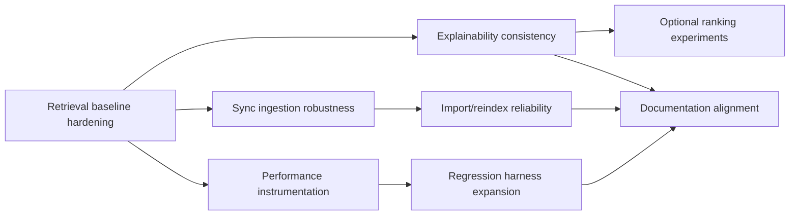

# ShelfEngine Implementation Milestones (V2)

> Status: Draft roadmap after MVP + extension baseline.
> Reference baseline: `docs/MILESTONES.md` (historical sequence).
> Product/technical anchor: `docs/SPEC_V2.md`.

---

## Roadmap Structure

- **Track A -- Retrieval quality and relevance**
- **Track B -- Reliability and sync correctness**
- **Track C -- Performance and developer confidence**

Each milestone must ship in a demoable state and avoid speculative extras.

---

## Milestone A1: Retrieval Quality Baseline Hardening

**Goal:** Stabilize hybrid ranking quality and operator behavior.

**Scope:**
- Validate lexical + semantic blending with representative queries.
- Verify `site:`, `folder:`, phrase, exclude, and OR semantics end-to-end.
- Ensure keyword-only fallback quality when embeddings are missing.

**Done when:**
- Manual regression checklist passes for query/operator matrix.
- No obvious regressions versus prior baseline queries.

---

## Milestone A2: Retrieval Explainability Consistency

**Goal:** Make "why matched" deterministic and trustworthy.

**Scope:**
- Standardize reason generation paths across search and chat.
- Confirm URL/domain/folder/title field mapping in explanations.
- Ensure reason caps and ordering remain predictable.

**Done when:**
- Similar queries yield consistent explanation patterns.
- No misleading reason text is shown for unmatched fields.

---

## Milestone A3: Ranking Experiments (Optional, Flagged)

**Goal:** Evaluate rank-fusion alternatives without destabilizing defaults.

**Scope:**
- Add optional rank-fusion mode(s), e.g. RRF, behind a developer flag.
- Compare against baseline using fixed query fixtures.
- Keep current default ranking unchanged unless metrics justify switch.

**Done when:**
- A short comparison report exists (baseline vs experimental).
- Default behavior remains stable and documented.

---

## Milestone B1: Sync Ingestion Robustness

**Goal:** Strengthen extension delta + resync ingestion reliability.

**Scope:**
- Validate idempotent upsert/remove behavior by normalized URL.
- Verify queue flush and resync acknowledgements in common failure scenarios.
- Confirm ingestion does not leave stale lexical or embedding state.

**Done when:**
- Manual sync scenarios (open app, closed app, reconnect) pass consistently.
- No duplicate bookmark rows after repeated replay attempts.

---

## Milestone B2: Import and Reindex Reliability

**Goal:** Improve resilience for repeated imports and index rebuild cycles.

**Scope:**
- Stress merge/replace paths with larger fixture bookmark sets.
- Validate status reporting for success/failure paths.
- Confirm post-import search readiness and expected latency envelope.

**Done when:**
- Import reliability checklist passes on repeated runs.
- Search returns coherent results immediately after import/index operations.

---

## Milestone C1: Performance Instrumentation

**Goal:** Make retrieval/index performance measurable and repeatable.

**Scope:**
- Add lightweight timing instrumentation for import/index/search critical paths.
- Capture baseline metrics on representative bookmark sets.
- Document expected ranges for local development machines.

**Done when:**
- Team can run one command/workflow to collect baseline numbers.
- Metrics are documented and referenced in architecture/dev docs.

---

## Milestone C2: Regression Harness Expansion

**Goal:** Improve confidence before merges with deterministic checks.

**Scope:**
- Expand search harness query set and expected qualitative checks.
- Add larger sample bookmark fixture(s) for regression/perf checks.
- Document a compact pre-merge validation checklist.

**Done when:**
- Regressions in ranking/operator behavior are quickly detectable.
- Pre-merge validation steps are documented and consistently usable.

---

## Milestone C3: Documentation Alignment

**Goal:** Keep docs synchronized with implementation reality.

**Scope:**
- Keep `ARCHITECTURE.md` retrieval/sync sections updated as behavior evolves.
- Keep README dev/testing instructions current.
- Maintain doc lineage notes between V1 and V2 docs.

**Done when:**
- New contributors can follow docs without stale instructions.
- V1 vs V2 document intent is explicit and unambiguous.

---

## Dependency Overview (V2)

---

## Backlog Parking Lot (Not committed yet)

- Automated integration tests for import + search + sync flows.
- UI affordances for search debugging (developer-only panels).
- Optional multi-device backup strategy definition.

---

## Exit Criteria for V2

- Retrieval quality is stable for real user queries.
- Sync/import behaviors are reliable under repeated use.
- Performance targets remain within expected envelope on ~1,000 bookmarks.
- Documentation and regression workflows are maintained as part of delivery.
